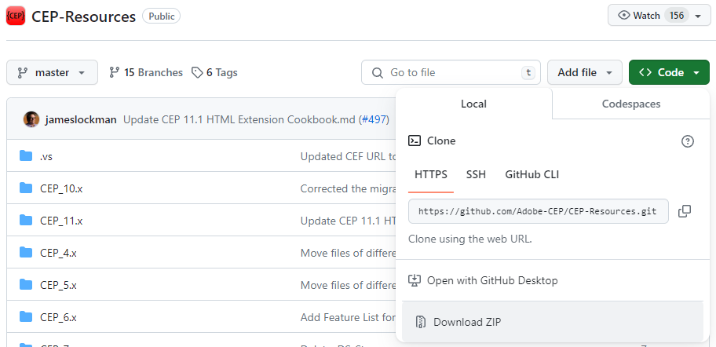

**A toolkit for creating extensions for programs from the Adobe CC package.**
# Quick Start

## Table-of-Contents

- [Quick Start](#Quick-Start)
    - [Environment Preparation](#Environment-Preparation-)
        - [Required Applications](#Required-Applications-)
            - [Adobe CC](#Adobe-CC-)
            - [CEP-Resources](#CEP-Resources-)
            - [Node JS](#Node-JS-)
            - [ZXP/UXP installer](#zxpuxp-installer-)
            - [Integrated Development Environment](#Integrated-Development-Environment-)
        - [Optional Applications](#Optional-Applications-)
            - [Git](#Git-)
            - [Notepad++](#Notepad-)
            - [Dialog Options Editor](#Dialog-Options-Editor-)
    - [Configuring tEB](#Configuring-tEB-)
    - [Creating a new extension.](#creating-a-new-extension--)

## Environment Preparation [**↑**](#Table-of-Contents)
The package was developed and tested on MS Windows.
It should work on Mac OS X but this hasn't been verified.
The generated extensions will fully function on Adobe CS for Mac OS X.

Prepare a dedicated folder for working with the extensions.
You will store the necessary applications and tools in it.

For the sake of this tutorial, I will call it `Extensions`, but you can choose any name you prefer.

### Required Applications [**↑**](#Table-of-Contents)
#### Adobe CC [**↑**](#Table-of-Contents)
To work with tEB, an account on [Adobe Creative Cloud](https://www.adobe.com/pl/creativecloud.html) with an active subscription (or in a trial period) is required.
Install the applications you want to create extensions for.
#### CEP-Resources [**↑**](#Table-of-Contents)
The package needs tools from the CEP-Resources package, which can be found at https://github.com/Adobe-CEP/CEP-Resources.
Place it in the `Extensions` folder. You can do this using GIT commands.

It might be easier for beginners to download the zipped archive and unpack it in the `Extensions` folder.

You can do this by clicking on the `Local` tab and then `Download ZIP`.
#### Node JS [**↑**](#Table-of-Contents)
tEb needs Node JS to operate.
Download the installation version from https://nodejs.org/en and follow the instructions.

Additional tips can be found at https://nodejs.org/en/learn/getting-started/how-to-install-nodejs.
#### ZXP/UXP installer [**↑**](#Table-of-Contents)
The ready extensions are saved as ZXP files.
You can download them from [Adobe Exchange](https://exchange.adobe.com/), they are then managed using Adobe CC Desktop.
For installing self-made extensions, we need an additional plugin manager. ZXP/UXP installer is perfect for this. 

Download the installer from https://aescripts.com/learn/zxp-installer and follow the instructions.
#### Integrated Development Environment [**↑**](#Table-of-Contents)
You'll need a code editor to work on the extensions. I use the paid IntelliJ IDEA application from [JetBrains](https://www.jetbrains.com).

You can use the free Fleet from JetBrains available at https://www.jetbrains.com/fleet or Microsoft's Visual Studio Code downloadable from https://code.visualstudio.com.

If you choose Visual Studio Code, you should also install the following extensions:
- `Auto-Save` for automatically saving changes: https://marketplace.visualstudio.com/items?itemName=mcright.auto-save
- `Markdown All in One` - for editing MD files: https://marketplace.visualstudio.com/items?itemName=deerawan.vscode-jasmine-es5
- `Task Explorer` - for displaying GULP commands in the form of a menu: https://marketplace.visualstudio.com/items?itemName=spmeesseman.vscode-taskexplorer
### Optional Applications [**↑**](#Table-of-Contents)
#### Git [**↑**](#Table-of-Contents)
A version control system can be very helpful in software development. However, it's not required, and I understand it can be challenging for beginner programmers.
You can download it from https://git-scm.com.
#### Notepad++ [**↑**](#Table-of-Contents)
This is a very useful text editor, which can be configured to display extension log files.
You can download it from https://notepad-plus-plus.org/downloads.

Instructions for configuration are provided at https://darekkay.com/blog/turn-notepad-into-a-log-file-analyzer.
#### Dialog Options Editor [**↑**](#Table-of-Contents)
If you want a comfortable way to edit dialog options, install the free i18n-editor application from https://github.com/jcbvm/i18n-editor.
## Configuring tEB [**↑**](#Table-of-Contents)
1. First, you need to install Node JS packages. You can do this by running the `npm install` command from terminal in the main package directory.
2. Now run the `gulp EXTENSION_BUILDER_init` command.
3. An `extensionbuilder.json` file will be created.
4. In your local copy of the package, update the paths in `extensionbuilder.json` so that they are
   consistent with the actual location of your Extension Builder package folder.
   - `paths.root` - Full path to the **Extension Builder** package folder
   - `paths.publicInstallerPath` - Full path to the folder where the production versions of extensions should be generated
   - `root.localExtensionsFolder` - Full path to the local folder with extensions
      - `~user/AppData/Roaming/Adobe/CEP/extensions`
   - `tools.adobeDebugConsole.path` - Full path to `cefclient.exe`
     from [Adobe Creative Cloud APIs and SDK](https://developer.adobe.com/apis/)
   - `tools.zip.path` - Full path to `7z.exe` ([7-Zip](https://7-zip.org.pl/))
   - `tools.installerGenerator.path` - Full path
     to `ISCC.exe` ([Inno Setup](https://jrsoftware.org/isdl.php))
   - `tools.adobeExtendScriptToolkit.path` - Full path to `ExtendScript Toolkit.exe`
     from [Adobe Creative Cloud APIs and SDK](https://developer.adobe.com/apis/)

## Creating a new extension [**↑**](#Table-of-Contents)
Nowe rozszerzenie możesz wygenerować poleceniem `gulp EXTENSION_create_new`. 

Jeżeli chcesz tylko przeprowadzić szybki próbę, to `gulp EXTENSION_create_test` utworzy rozszerzenie z predefiniowanymi danymi.

Szczegółową instrukcję znajdziesz w [Template Tutorial](../Templates/Indd-PS-AI%20template/04%20documentation/template-documentation/Tutorial.md).
