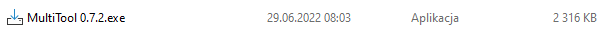
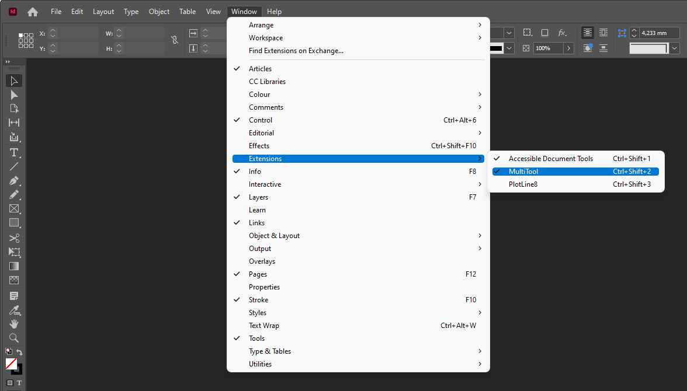
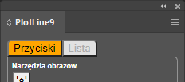
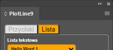
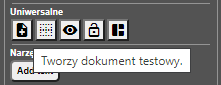
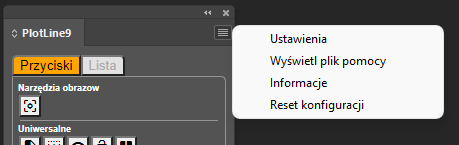
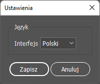
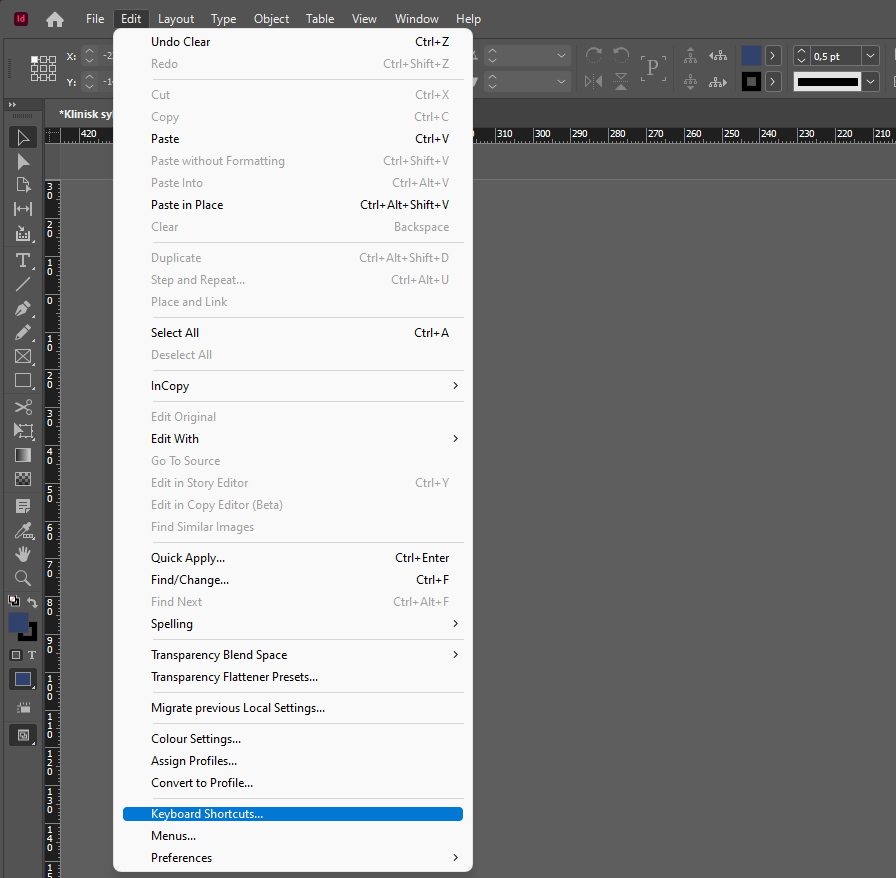

# Instrukcja

Template
=================

Wszelkie prawa zastrzeżone.

Wersja beta.

Wstęp
-----

##extensionName## jest rozszerzeniem dla programów z pakietu Adobe CC: InDesign, Photoshop oraz Illustrator. Dodaje nowe funkcjonalności lub usprawnia istniejące.

Jego głównym przeznaczeniem jest podniesienie komfortu pracy w DTP. Usprawnia najbardziej uciążliwe prace przy składzie i projektowaniu.

Pierwsze uruchomienie
---------------------

### Instalacja

#### Windows

Rozszerzenie jest dostarczane w pakiecie z automatycznym instalatorem. Przed jego uruchomieniem należy zamknąć wszystkie aplikacje Adobe.

Następnie należy uruchomić instalator i poczekać na zakończenie operacji.

#### Mac OS X

Dla komputerów Macintosh rozszerzenie jest w postaci archiwum 7-zip. Należy rozpakować pliki i przenieść folder z rozszerzeniem do katalogu Extensions.

### Uruchomienie w aplikacji

W InDesign w menu górnym rozwijamy pozycję "Window", a następnie z pola "Extensions" wybieramy nazwę rozszerzenia .

Menu z rozszerzeniami w InDesign.

### Interfejs

Funkcje są dostępne z poziomu paletki, jako przyciski lub w menu bocznym. Paletka podzielona jest na panele z kategoriami według zastosowań. Każdy panel zawiera dedykowane do danego działania przyciski.

Obraz paletki rozszerzenia Multitool.

Panele można przełączać, klikając w ich nazwę. Na grafice są widoczne dwa, w miarę rozwoju rozszerzenia, może się pojawić ich więcej.

  

Przyciski paneli "Narzędzia" i "Grep".

Przyciski mają krótkie opisy, które pokazują się nad wybranym elementem po przytrzymaniu na nim kursora przez dwie sekundy.

Dymek pomocy.

Kliknięcie na ikonkę w prawym górnym rogu paletki wyświetla menu boczne.

Opcje dostępne w menu bocznym.

Funkcjonalności
---------------

### Panel Narzędzia

#### Narzędzia obrazów

Grupa narzędzi dedykowana do konwersji elementów graficznych.

 

Rasteryzuje zaznaczenie.

Spłaszcza wszystkie warstwy.

#### Uniwersalne

Pokaż wszystkie ukryte elementy.

Kasuje wszystkie linie pomocnicze w dokumencie.

Tworzy nowy dokument.

Odblokowuje wszystkie elementy w dokumencie.

Rozdziela wszystkie grupy w dokumencie.

#### Narzędzia tekstowe

Dodaje tekst.

### Panel Lista

#### Lista tekstowa

Demonstracja działania listy rozwijanej.

Dodaje tekst wybrany z listy.

### Menu boczne

#### Ustawienia

Pozwala na wybranie dodatkowych ustawień rozszerzenia. Np. zmianę języka interfejsu.

Wraz z rozwojem rozszerzenia pojawi się więcej opcji w panelu ustawień.

#### Wyświetl plik pomocy

Wyświetla w domyślnej przeglądarce plik pomocy.

#### Informacje

Wyświetla informacje na temat wersji rozszerzenia. Dzięki temu możemy sprawdzić, czy mamy zainstalowaną najnowszą wersję.

#### Reset konfiguracji

Resetuje wszystkie ustawienia rozszerzenia do domyślnych. Opcja przydatna w przypadku nieprawidłowego działania rozszerzenia.

Skróty klawiaturowe
-------------------

Rozszerzenia daje możliwość zdefiniowania skrótów klawiszowych do niektórych funkcjonalności. Skróty definiujemy przez standardowy panel ustawień InDesign dostępny w menu "Edit".

Wywoływanie panelu skrótów klawiaturowych z menu.

Po wywołaniu panelu, wybieramy z listy "Product Area" pozycję "Scripts". Następnie szukamy na liście pozycji zaczynającej się od "User:" i nazwy naszego rozszerzenia. Na końcu jest nazwa dostępnej funkcji.

Przypisywanie skrótu do funkcjonalności rozszerzenia.

Zaznaczamy pozycję z wyszukaną funkcją i klikamy w okienko "New Shortcut". Teraz każde naciśnięcie dowolnej kombinacji klawiszy powoduje wpisanie jej do okienka. Pod okienkiem wyświetlana jest informacja, czy wybrany skrót jest już do czegoś używany. Wybór zatwierdzamy przyciskiem "Assign". Zdefiniowany skrót pojawia się na liście "Current Shortcuts".

Po zdefiniowaniu skrótu należy jeszcze zapisać w aplikacji całe ustawienia przyciskiem "Save".