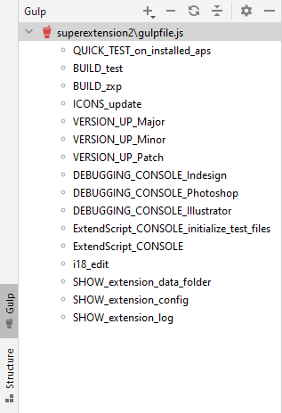

# Technical documentation of the template

**Adobe InDesign, Photoshop and Illustrator Extension**


## Table of Contents

1. [Description](#Description-)
2. [Developer tools](#Developer-tools-)
   - [Extension generation](#extension-generation-):
     - [Quick test](#quick-test-)
     - [Test version](#test-version-)
     - [Install version](#install-version-)
   - [Versioning](#versioning-)
   - [Resource Update](#resource-update-)
   - [Debugging Console](#debugging-console-):
     - [ExtendScript Console](#extendscript-console-)
     - [ExtendScript Test Files](#extendscript-test-files-)
     - [Console launch](#console-launch-)
   - [Dialog editor](#dialog-options-editor-)
   - [Files created by the extension](#files-created-by-the-extension-)
     - [Local folder](#local-folder-)
     - [Configuration file](#configuration-file-)
     - [Log file](#log-file-)
3. [File structure](#File-structure-)
4. [How the extension works](#how-the-extension-works-)
    - [Startup sequence](#Startup-sequence-)
    - [Configuration file](#configuration-file-)
    - [Lifecycle](#Lifecycle-)
5. [UI configuration object structure](#UI-configuration-object-structure-)
    - [Side Menu Item (`flyoutMenu`)](#Side-menu-item-flyoutMenu-)
    - [Panels (`panels`)](#Panels-panels-)
    - [Container (`container`)](#Container-container-)
    - [Separator (`line`)](#separator-line-)
    - [Text (`text`)](#text-text-)
    - [Dropdown list](#dropdown-list-)
        - [Main dropdown list object `(dropDownList)`](#main-dropdown-list-object-dropDownList-)
        - [List item `(dropDownListItem)`](#List-item-dropDownListItem-)
    - [Button with text label (`textButton`)](#button-with-text-label-textbutton-)
    - [Button with icon (`iconButton`)](#button-with-icon-iconbutton-)
 

## Description [**↑**](#Table-of-Contents)
A template for extensions for InDesign, Photoshop and Illustrator applications.
Key features:
- hybrid support (from CEP and ExtendScript) for the JSON configuration file,
- standardized interface for asynchronous ExtendScript code calls,
- generic user interface,
- help system,
- multi-language support,
- update control system,
- hybrid (from CEP and ExtendScript) log recording system in Log4J format.

## Developer tools [**↑**](#Table-of-Contents)

The repository includes a set of tools in the [Gulp](https://gulpjs.com/) environment to aid in the creation of the extension. 

---
**TIP**

Some IDEs allow commands to be displayed in the form of a menu.
It can be conveniently used by clicking on it with a mouse.
This is what the menu in IntelliJ IDEA looks like:



---

Below is a description of the available functionalities.

### Extension generation [**↑**](#Table-of-Contents)
Instructions on creating an extension in various scenarios.
#### Quick test [**↑**](#Table-of-Contents)
Generate an extension and copy the ready package to the local Adobe CC package extension directory:
> **gulp**  `QUICK_TEST_on_installed_aps`

This enables immediate testing in the target application. Since the extension code is loaded into memory at the time of the launch of the palette, loading a new version requires a refresh. In InDesign and Photoshop it is sufficient to reload the palette (close and restart), Illustrator requires a full restart.
#### Test version [**↑**](#Table-of-Contents)
Generate an extension to the `02 build` directory. This allows you to check the correctness of the extension generation and test distribution:
> **gulp**  `BUILD_test`
#### Install version [**↑**](#Table-of-Contents)
Generate an extension and create a **ZXP** file in the `03 installer` directory:
> **gulp**  `BUILD_with_installer`


### Versioning [**↑**](#Table-of-Contents)
The extension versioning is consistent with the [Semantic Versioning 2.0.0](https://semver.org) standard. Changing the version requires updating it in the files:
- `package.json`
- `extension.json`
- `README.md`
- `manifest.xml`
- `defaultConfig.js`
- `innoScriptConfigFile.iss`
  
The commands below automate this process.

Raising the version `Major` and zeroing out the rest (+.0.0):
>**gulp**  `VERSION_UP_Major`

Increasing the `Minor` version and zeroing out the `Patch` (x.+.0):
>**gulp**  `VERSION_UP_Minor`

Increasing the `Patch` version (x.x.+):
>**gulp**  `VERSION_UP_Patch`

### Resource Update [**↑**](#Table-of-Contents)

Downloading the current Google Materials Icons from the home repository:
>**gulp**  `ICONS_update`

### Debugging Console [**↑**](#Table-of-Contents)
The debugging console must be run separately for each application in the Adobe CC package, because the extension creates a separate instance in memory for InDesign, Photoshop and Illustrator. Each instance is available at a different console port.
#### Indesign [**↑**](#Table-of-Contents)
Start the debugging console for the extension running in the InDesign program:
>**gulp**  `DEBUGGING_CONSOLE_Indesign`
#### Photoshop [**↑**](#Table-of-Contents)
Start the debugging console for the extension running in the Photoshop program:
>**gulp**  `DEBUGGING_CONSOLE_Photoshop`
#### Illustrator [**↑**](#Table-of-Contents)
Start the debugging console for the extension running in the Illustrator program:
>**gulp**  `DEBUGGING_CONSOLE_Illustrator`
### ExtendScript Console [**↑**](#Table-of-Contents)
The console allows for direct testing of the ExtendScript written code. You should bear in mind that ExtendScript running at the extension level **does not return errors in the debugging console!**. Errors only cause the closure of the current function.
The generated files, run in Adobe ExtendScript Toolkit, at the beginning import **the right context** for tests. This is:
- all code (for the target application) from the `01 source/assets/appCode/libraries` directory,
- default config file,
- an interface for language files.

This allows for quick testing of any (standalone) code blocks. 

The first run requires a prior call to the Gulp `make ExtendScript test files` command.
#### ExtendScript Test Files [**↑**](#Table-of-Contents)

Creates test files in the `05 Tools` directory:
 
>**gulp**  `ExtendScript_CONSOLE_initialize_test_files`

Each launch causes the files to be reset.

#### Console launch [**↑**](#Table-of-Contents)

Launching the test console (Adobe ExtendScript Toolkit) for the default application

>**gulp**  `ExtendScript_CONSOLE`

### Dialog options editor [**↑**](#Table-of-Contents)

You can launch the dialog options editor with the command:

>**gulp** `i18_edit`

### Files created by the extension [**↑**](#Table-of-Contents)

You can check the extension's functionality by inspecting the files where configuration and current messages are stored.

#### Local folder [**↑**](#Table-of-Contents)

Upon launch, the extension creates its own folder in the user space.
You can display it in the default system application with the command:

>**gulp** `SHOW_extension_data_folder`

#### Configuration file [**↑**](#Table-of-Contents)

During operation, the extension saves its configuration in the config.json file.
You can display it in the system editor using the command:

>**gulp** `SHOW_extension_config`

#### Log file [**↑**](#Table-of-Contents)

Extension functions can include commands that write various parameters to a log file.
You can view this file in the system editor by using the command:

>**gulp** `SHOW_extension_log`


## File Structure [**↑**](#Table-of-Contents)
`01 source/` - extension source files
- `assets/`
    - `appCode/`
        - `libraries/` - prefixes `ALL_`, `IDSN_`, `PHXS_`, `ILST_` determine which applications the libraries will be loaded into. Files can be freely modified and added, they will be automatically loaded.
            - `ALL_base64.jsx` - Universal functions for file handling.
            - `ALL_fileLib.jsx` - Universal functions for file handling.
            - `ALL_json2.jsx` - Library adding JSON support.
            - `ALL_SUI.jsx` - Functions related to UI in ExtendScript.
            - `ALL_universalLib.jsx` - Universal functions for all applications.
            - `IDSN_InDesignLib.jsx` - Functions for InDesign.
            - `IDSN_tools.jsx` - Utility functions for InDesign.
            - `PHXS_PhotoshopLib.jsx` - Functions for Photoshop.
            - `ILST_Illustrator.jsx` - Functions for Illustrator.
        - `sources/`
            - `API_Illustrator.jsx` - Object containing ExtendScript calls for the palette
            - `API_InDesign.jsx` - Object containing ExtendScript calls for the palette
            - `API_Photoshop.jsx` - Object containing ExtendScript calls for the palette
    - `css/`
        - `style.css` - general style sheet
        - `styles-dark.css` - styles for the selected UI theme of the application
        - `styles-light.css` - styles for the selected UI theme of the application
        - `styles-medium-dark.css` - styles for the selected UI theme of the application
        - `styles-medium-light.css` - styles for the selected UI theme of the application
    - `help/` - directory with the help file
        - `css/` - stylesheet for help
        - `images-en/` - images in English version
        - `images-en/` - images in the Polish version
        - `images-pl/` - main help file
        - `js/` - JavaScript files for help
        - `help-pl.html` - help file in English version
        - `help-pl.html` - help file in the Polish version
    - `i18n/` - directory with language files in `JSON` format
        - `en_GB/` - dialogue options in the English version
        - `en_PL/` - dialogue options in the English version
    - `iconfont/` - directory with fonts/icons from [Google Materials](https://material.io/resources/icons/?style=baseline)
    - `libraries/`
        - `jquery-1.9.1.js` - [jQuery JavaScript Library v1.9.1](http://jquery.com)
        - `CSInterface.js` - [Adobe CSInterface - v9.4.0](https://github.com/Adobe-CEP/CEP-Resources/tree/master/CEP_9.x)
        - `Vulcan.js` - [Adobe Vulcan - v9.4.0](https://github.com/Adobe-CEP/CEP-Resources/tree/master/CEP_9.x)
    - `panelCode/`
        - `global.js` - global variables
        - `actions.js` - set of invoking functions
        - `configHandler.js`- functions handling the configuration object
        - `defaultConfig.js` - default configuration object
        - `uiConfig.js` - object with UI configuration
        - `ext.js` - initiating functions refreshing the palette and responsible for synchronizing the extension's CSS with the UI of the parent application
        - `flyoutMenu.js` - function generating the side menu of the palette
        - `panel.js` - set of functions allowing generic addition of UI elements
    - `start.jsx` - adds `evalFile` and `evalFiles` methods to `$`, initiated from the manifest
- `CSXS/`
    - `manifest.xml` - extension manifest
- `.debug` - file enabling debugging mode of the extension
- `index.html` - main html file of the palette

## How the extension works [**↑**](#Table-of-Contents)
### Startup sequence [**↑**](#Table-of-Contents)
The extension is initialized in the following steps:
During the startup of the parent application, the extension is registered.
Starting the palette initializes the extension instance in the steps:
1. Loading `manifest.xml` defining the extension, manifest declares the palette and points out the main HTML file.
2. Running `index.html` in the extension window.
3. Loading JavaScript files from the `index.html` header.
4. Execution of function `onLoaded()` initializes the palette operation.
    - Sets global variables,
    - Synchronizes the color scheme of applications and palette,
    - `loadJSX()` loads `ExtendScript` code,
    - `updateUI()` loads the user interface settings from `config.json`.
      - `getFlyoutMenu()` sets the side menu, list items are taken from the `uiConfig.flyoutMenu` constant.
      - In the next step, paths and shortcuts are updated.
      - The main UI container is reset.
      - `addGuiElements()` rebuilds the interface. The arrangement of elements is taken from the constant `uiConfig.guiElements`, all interface elements are displayed and actions are connected to them.
      - Actions are called by functions from the `actions.js` file.
      - These functions can call `ExtendScript` methods defined in files: `API_Illustrator.jsx`, `API_InDesign.jsx`, `API_Photoshop.jsx`.
5. The main loop of the extension is based on:
    - User invoking the actions assigned to the palette interface elements.
    - The `config.json` content is always passed to the actions.
    - Actions perform tasks defined in them, parameters defining operation are taken from `config.json`.
    - Upon completion, they modify and return `config.json`. In this way, they can change the extension state.
    - The action handling function saves `config.json` and triggers `updateUI()`.
    - `updateUI()` updates the extension status based on `config.json`.

Only basic containers are added in `index.html`. 
The detailed layout of the elements is defined in the `uiConfig` constant in the `uiConfig.js` file. 
Variable extension parameters are written to the `config.json` file. 

### Configuration file [**↑**](#Table-of-Contents)

The configuration file is saved in the user directory. 
The functions in the `configHandler.js` file are responsible for its handling. 
The default configuration is in `defaultConfig.js`.

`uiConfig.js` file contains all the variables needed for the extension to work properly.
The UI state is remembered here. Below is a description of the basic fields:
- `language` - The default language setting.
- `appLabelKey` - The unique identifier for the application ExtendScript label.
- `appId` - The unique identifier for the application.
- `appVersion` - The version number of the application. Object containing current and update versions.
- `folderForScriptsFilesShortcuts` - The folder for scripts and files shortcuts.
- `logFileName` - The log file name.
- `serverAddress` - Update server address.
- `helpFileRelativePaths` - An array of relative paths for help files.
- `selectedElements` - An array of selected elements.
- `rasterImageConfig` - An object containing the image rasterization configuration.

You can add more as needed.

### Lifecycle [**↑**](#Table-of-Contents)


The above diagram illustrates the life cycle of the extension.

## UI configuration object structure [**↑**](#Table-of-Contents)

The UI configuration is located in the `uiConfig` constant in the `uiConfig.js` file. 
The object contains two arrays: `flyoutMenu` and `guiElements`.

```
{
    flyoutMenu: [],
    guiElements: []
}
```
To improve readability, I used auxiliary variables to define child elements. 
I connect them to the parent using the concat function, like this:
- `flyoutMenu: [].concat(flyoutMenuItems)`,
- `children: [].concat(imagesTools, universalTools, textTools)`.

The UI structure is built hierarchically. The main elements are panels, smaller ones are added recursively as their children.

I have defined several types of elements, more can be added as needed. 
This is the list of defined elements:
- [flyoutMenu](#side-menu-item--flyoutMenu-)
- [panels](#panels--panels-)
- [container](#container--container-)
- [line](#separator--line-)
- [text](#text--text-)
- [dropDownList](#Dropdown-list--dropdownlist-)
- [dropDownListItem](#List-item--dropownlistitem-)
- [textButton](#button--textbutton-)
- [iconButton](#button-with-icon--iconbutton-)

Detailed descriptions are provided in the following sections.

### Side Menu Item (`flyoutMenu`) [**↑**](#Table-of-Contents)

Items in the sidebar menu of the palette are generated based on the `flyoutMenu` array. 

Definition of the object:

```
{
    name: 'name',
    type:'flyoutMenu',
    textLabelNode: "preferences",
    textLabel: "menu_text",
    enabled: true,
    action: 'preferences'
}
```
- **name** - which will simultaneously be the ID of the object in the DOM.
- **type** - Constant type definition required by the building function.
- **textLabelNode** - Reference to a group, in an object with a multilingual dictionary.
- **textLabel** - Reference to a label, in an object with a multilingual dictionary, containing the displayed text.
- **enabled** - The activity of the element
- **action** - The name of the ES6 or ExtendScript function called by the element, which also serves as the item ID.

Interface elements are added hierarchically to the `guiElements` array.

The available types are described below.

### Panels (`panels`) [**↑**](#Table-of-Contents)

Object defining panels switched by buttons. Each must contain containers. Their titles will be displayed as multistate buttons.

Object definition:

```
{
    name:'name', 
    type:'panels', 
    apps: ['AICY', 'IDSN', 'ILST', 'PHXS'], 
	cssClass: [],
    children: []
}
```
- **name** - which will simultaneously be the ID of the object in the DOM.
- **type** - Constant type definition required by the building function.
- **apps** - Applications where the element will be displayed, also applies to child elements.
- **cssClass** - Names of CSS classes to be assigned to the element.
- **children** - Descendant elements.

### Container (`container`) [**↑**](#Table-of-Contents)

The object that defines the container. It is used for organizing and aggregating child elements. 

Object definition:

```
{
    name:'name', 
    text:'reference to the dictionary'
    type:'container', 
    apps: ['AICY', 'IDSN', 'ILST', 'PHXS'], 
	cssClass: [],
    children: [] 
}
```

- **name** - which will simultaneously be the ID of the object in the DOM.
- **text** - Reference to a label in a multilingual dictionary object, containing the displayed text.
- **type** - Constant type definition required by the building function.
- **apps** - Applications where the element will be displayed, also applies to child elements.
- **cssClass** - Names of CSS classes to be assigned to the element.
- **children** - Descendant elements.

### Separator (`line`) [**↑**](#Table-of-Contents)

An object that defines a separator - a line with parameters defined by assigned CSS classes. Used for separating elements.

```
{
    name:'name', 
    type:'line',
    apps: ['AICY', 'IDSN', 'ILST', 'PHXS'],
    cssClass: []
},
```
- **name** - which will simultaneously be the ID of the object in the DOM.
- **type** - Constant type definition required by the building function.
- **apps** - Applications where the element will be displayed, also applies to child elements.
- **cssClass** - Names of CSS classes to be assigned to the element.

### Text (`text`) [**↑**](#Table-of-Contents)

An object defining a text label always as `<p>`. The visual differentiation is solely due to the assigned CSS classes. Useful  for displaying headlines and ordinary text.

```
{
    name:'name', 
    text:'reference to the dictionary'
    type:'text',
    apps: ['AICY', 'IDSN', 'ILST', 'PHXS'],
    cssClass: []
}
```
- **name** - which will simultaneously be the ID of the object in the DOM.
- **type** - Constant type definition required by the building function.
- **text** - Reference to a label in a multilingual dictionary object, containing the displayed text.
- **apps** - Applications where the element will be displayed, also applies to child elements.
- **cssClass** - Names of CSS classes to be assigned to the element.

### Dropdown list [**↑**](#Table-of-Contents)
#### Main dropdown list object (`dropDownList`) [**↑**](#Table-of-Contents)
An object defining a dropdown list. The status of the list is updated in the configuration file and provides a context for the commands executed.

```
{
    name:'name', 
    type:'dropDownList',
    apps: ['AICY', 'IDSN', 'ILST', 'PHXS'],
    cssClass: []    
    items: []
}
```
- **name** - which will simultaneously be the ID of the object in the DOM.
- **type** - Constant type definition required by the building function.
- **apps** - Applications where the element will be displayed, also applies to child elements.
- **cssClass** - Names of CSS classes to be assigned to the element.
- **items** - List elements.

#### List Item `(dropDownListItem)` [**↑**](#Table-of-Contents)
An object defining a child element of a dropdown list.
```
{
    name:'name', 
    type:'dropDownListItem',
    text:'reference to the dictionary'
}
```
- **name** - The name that will also be the ID of the object in the DOM.
- **type** - Constant type definition required by the builder function.
- **text** - Reference to a label in a multilingual dictionary object, containing the displayed text.

### Button with text label (`textButton`) [**↑**](#Table-of-Contents)

An object defining a button with text name that triggers the assigned action in ExtendScript.
```
{
    name: 'name',
    toolTipText: 'reference to dictionary',
    text: 'reference to dictionary',
    type: 'textButton',
    apps: ['AICY', 'IDSN', 'ILST', 'PHXS'],
    cssClass: [],
    adobeScript: 'ExtendScript function'
}
```
- **name** - which will simultaneously be the ID of the object in the DOM.
- **toolTipText** - Reference to the label, in the multilingual dictionary object, containing the tooltip for the button (hint displayed when hovering over it).
- **text** - Reference to the label, in the multilingual dictionary object, containing the text displayed on the button.
- **type** - Constant type definition required by the building function.
- **apps** - Applications where the element will be displayed, also applies to child elements.
- **cssClass** - Names of CSS classes to be assigned to the element.
- **adobeScript** - Name of the ExtendScript function invoked by the element


### Button with icon (`iconButton`) [**↑**](#Table-of-Contents)

An object defining a button with an icon from the [Material Design](https://fonts.google.com/icons) set, triggering the assigned action in ExtendScript.
```
{
    "name": "name",
    "toolTipText": "reference to the dictionary",
    "type": "iconButton",
    "apps": ["AICY", "IDSN", "ILST", "PHXS"],
    "cssClass": ["iconButton"],
    "iconCode": "center_focus_weak",
    "adobeScript": "ExtendScript function"
}
```

- **name** - which will simultaneously be the ID of the object in the DOM.
- **toolTipText** - Reference to the label, in the multilingual dictionary object, containing the tooltip for the button (hint displayed when hovering over it).
- **type** - Constant type definition required by the building function.
- **apps** - Applications where the element will be displayed, also applies to child elements.
- **cssClass** - Names of CSS classes to be assigned to the element.
- **iconCode** - Icon code from the Material Design set
- **adobeScript** - Name of the ExtendScript function invoked by the element


