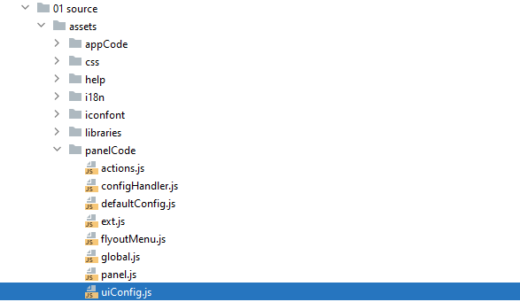
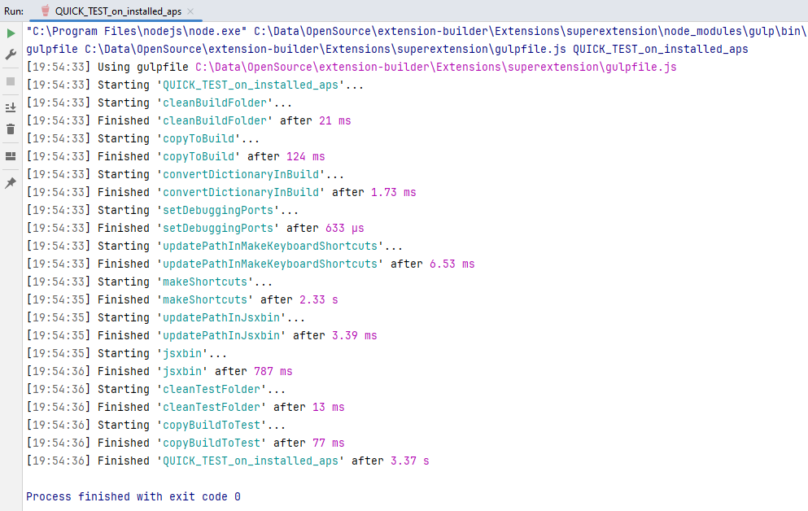
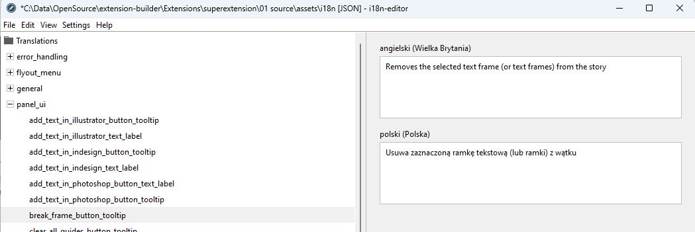

# Tutorial
If you want to add your functionality to the extension, just follow a few simple steps. You don't even have to write the script yourself.

You can use programs found on the internet and generate your own extension. With buttons customized to your needs.
Here, I will show in simple steps how to add a ready-made script provided with InDesign, as a new button in the extension.

As an example, I will use a test extension generated by the Extension Builder. You can find a description of how to do this in its [documentation](../../../../README.md).
To start this tutorial, you need to have it open in an IDE.
In this example, I am using [IntelliJ IDEA](https://www.jetbrains.com/webstorm).

## Table of Contents
1. [Introduction](#tutorial)
2. [Function in ExtendScript](#function-in-extendscript-)
   - [Copying the script](#copying-the-script-)
   - [Adjusting the script](#adjusting-the-script-)
   - [Testing the Script](#test-the-script-)
3. [Adding a script to the API](#adding-a-script-to-the-api-)
4. [UI Expansion](#ui-expansion-)
   - [New group of elements](#new-group-of-elements-)
   - [Group Name](#group-name-)
   - ["Break Frame" Button](#break-frame-button-)
   - [Test UI](#test-ui-)
5. [Dialogue Options](#dialogue-options-)
6. [Extension Testing](#extension-testing-)
7. [Help File](#help-file-)
8. [Installation Version](#installation-version-)

## Function in ExtendScript [**↑**](#Table-of-Contents)
For the example, I chose `BreakFrame`, but it can be any script that works on a selection.
Others you will have to customize.

### Copying the script [**↑**](#Table-of-Contents)
In InDesign from the `Scripts` palette, select `BreakFrame` and open it in any editor.


Right mouse button brings up the context menu.


Then save it as `IDSN_breakFrame.jsx` in the directory `./01 source/assets/appCode/libraries`.


### Adjusting the script  [**↑**](#Table-of-Contents)
Now the script needs to be adjusted for use in the extension so that it can be invoked by a button.
The main function of this script is named `main`. The file is prepared for automatic startup from the palette in InDesign, so in line 16 it has a function call.


Let's change its name to `breakFrame` and remove the call.


### Test the Script [**↑**](#Table-of-Contents)
Before adding your script as a button, ensure it functions properly within the extension environment.
In your IDE terminal, run the command `gulp ExtendScript_CONSOLE_initialize_test_files`.


In the `06 tests` directory, `jsx` files with extension context for each application will be created.


Run the `gulp ExtendScript_CONSOLE` command.
The `Adobe ExtendScript Toolkit CC` will open with the newly created test file.


Since the test script is used to separate text frames, we now need to create a document with two connected frames in Adobe InDesign.


Next, we add the `breakFrame()` command in the `ExtendScript Toolkit CC`, which will run the script. Now, select the frame in InDesign and click `play` in the `ExtendScript Toolkit CC`.


The frames have been separated! This means the script worked correctly in our extension.


## Adding a script to the API [**↑**](#Table-of-Contents)
ExtendScript and UI operate in different environments. In my solution, they connect through object methods from files:
- API_Illustrator.jsx
- API_InDesign.jsx
- API_Photoshop.jsx
  
Files are located in the `01 source/assets/appCode/sources` directory.
Open the `API_InDesign.jsx` file. There is only one object named `API_InDesign.jsx` with many methods.

We will add the invocation of our function at the end.


Function invocation usually looks like:

```
    extendScripFunctionName : function (config){
        extendScripFunctionName();
        return JSON.stringify(config);
    },
```

After adding `breakFrame`, it should look like this:


## UI Expansion [**↑**](#Table-of-Contents)
Now we will deal with adding UI elements.
To do this, open the file:



Our panel now looks like below.


The look of the "Buttons" panel is defined in lines 319-326.


Button groups are defined in the auxiliary variables: `imagesTools`, `universalTools`, `textTools`.

### New group of elements [**↑**](#Table-of-Contents)
Let's add a new button group called "Frame tools", based on the `imagesTools` definition.


In line 104, let's add a new variable `frameTools`.

```
    const `frameTools` = [];
```

#### Group Name [**↑**](#Table-of-Contents)
Next, we can copy an object of type `textLabel` from `imagesTools` to our array.

```
    const `frameTools` = [
        {
            name:'toolsPanelNo1Title1',
            text: 'images_tools',
            type:'textLabel',
            apps: ['IDSN', 'ILST', 'PHXS'],
            cssClass: ['toolsPanelButtonTitle', 'default']
        }
    ];
```

Now we need to enter new data.
Change the name to another, unique one: `name:'toolsPanelNo1Title0'`
You need to provide a new label for the dialog box: `text: 'frame_tools'`,
Then you need to define in which applications the button should appear:
- InDesign: `IDSN`,
- Illustrator: `ILST`,
- Photoshop: `PHXS`.

The `breakFrame` function is intended solely for InDesign, so our definition is: `apps: ['IDSN']`.
 We will leave the CSS classes default for `textLabel`. We should get this effect:

```
    const frameTools = [
        {
            name:'toolsPanelNo1Title0',
            text: 'frame_tools',
            type:'textLabel',
            apps: ['IDSN'],
            cssClass: ['toolsPanelButtonTitle', 'default']
        }
    ];
```

#### "Break Frame" Button [**↑**](#Table-of-Contents)

Now, let's add a button that will call our function. Let's use convertSelectionToRasterImage object as a pattern.
```
    const frameTools = [
        {
            name:'toolsPanelNo1Title0',
            text: 'frame_tools',
            type:'textLabel',
            apps: ['IDSN'],
            cssClass: ['toolsPanelButtonTitle', 'default']
        }
    ,
        {
            name:'convertSelectionToRasterImage',
            toolTipText: 'convert_selection_to_raster_image_button_tooltip',
            type:'iconButton',
            apps: ['IDSN'],
            cssClass: ['iconButton'],
            iconCode:'center_focus_weak',
            adobeScript:'convertSelectionToRasterImage'
        }
        
    ];
```

We change the name to: breakFrame. toolTipText is the label to which the tooltip text will be assigned.
Zmieniamy nazwę na: `breakFrame`.
`toolTipText` to etykieta do której będzie przypisany tekst podpowiedzi.****


Let's call it `break_frame_button_tooltip`.
We still need to choose an icon for our button.
On the page https://fonts.google.com/icons we can view available icons.
After clicking on the selected image, a side menu appears on the right.
There we will find the name of the icon.


We copy it to our code: `iconCode:'content_cut'`.
Finally, we need to provide the name of the `ExtendScript` function that will be triggered by the button.
We defined it earlier in `API_InDesign.jsx`.
After substitution, it will be: `adobeScript:'breakFrame'`.
The whole should look like below.


Finally, we just need to add our group to the panel.


## Test UI [**↑**](#Table-of-Contents)
We will call a command that will generate a test version of the extension.

---
***Attention!***

***The following gulp commands use ExtendScript Toolkit CC:***
- `QUICK_TEST_on_installed_aps`
- `BUILD_test`
- `BUILD_zxp`

***To work properly, it must be closed earlier!***

---

To tests the extension, we need to run InDesign in debug mode. In Windows, you can use the command for this purpose:
`gulp QUICK_TEST_on_installed_aps`. Information on how to run it in Mac OS X can be found [here](https://github.com/Adobe-CEP/Getting-Started-guides/blob/master/Client-side%20Debugging/readme.md#set-the-debug-mode).

Now we will call the command in our IDE terminal:
`gulp QUICK_TEST_on_installed_aps`



If the extension is being built for the first time, you need to restart InDesign. In subsequent cases, it is enough to close and open the extension palette.


Great, the extension works. We just lack the dialog options.

## Dialogue Options [**↑**](#Table-of-Contents)
'!!! frame_tools' at the beginning means that no text has been assigned to the `frame_tools` label.
The dictionaries are located in the folder:


It is most convenient to add texts using the i18n-editor application.
You can run it using the `gulp i18_edit` command.
Make sure the correct dictionary folder is open, if not, you can do so by selecting the import option from the file menu.  


Our project has dictionaries in two languages. You can add more or remove selected ones.


The dialog options for the UI palette are grouped in `panel_ui`.


We can add text for the next label by right-clicking on `panel_ui`.


A window with a parent key shows up.


We add our label for the category name to it and click ok.


Now on the right, fields for text in each language appear.
We type the texts that should be displayed on the palette.


We proceed the same way with the help text for the button.



Finally, you need to save the changes.


We can close i18n-editor.

## Extension Testing [**↑**](#Table-of-Contents)
Now you should rebuild the test version again.

`gulp QUICK_TEST_on_installed_aps`

Close the extension.

---

**TIP**

If you plan on doing a lot of extension testing, it's worth assigning a keyboard shortcut to it in InDesign.

You can find the options in the menu: `Edit -> Keyboard Shortcuts...`.


---

After a restart, a fully working palette is shown to us.


The gulp `SHOW_extension_data_folder` command will open the folder in which the extension saves its configuration file and log file. 

You can review them to make sure everything is working correctly.


**Bravo. You've made your first extension!**

## Help File [**↑**](#Table-of-Contents)

Finally, it is worth completing the help file. For each language, there is a separate `html`.


## Installation Version [**↑**](#Table-of-Contents)

Now, using the `gulp BUILD_zxp` command, you can generate a ZXP version for your friends.
The ZXP file is Adobe's standard format for extensions.

When it comes to your own extensions, it is best to install them using the [ZXP/UXP installer](https://aescripts.com/learn/zxp-installer/).